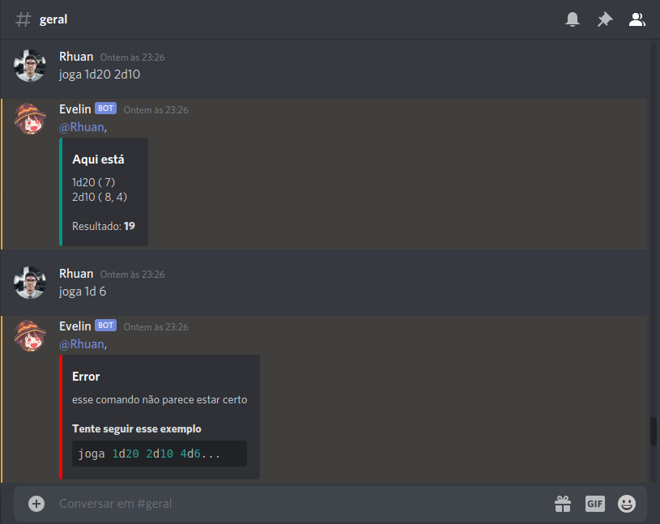

<h1 align="center">DiscordBot</h1>

<p align="center">Discord <strong>Bot</strong> em Nodejs</p>

<p align="center">
  <a aria-label="Versão do Node" href="https://github.com/nodejs/node/blob/master/doc/changelogs/CHANGELOG_V12.md#12.16.1">
    </img>
  </a>
</p>

## Instalação 
Para instalar as dependências e executar o **Bot** (em modo desenvolvimento), clone o projeto em seu computador e em seguida execute:
```bash
yarn install
ou
npm install
```

Caminhe até a pasta config em src e execute:
```bash
cp config_example.json config.json
```

Em seguida altere a linha token do arquivo config.json para um token valido gerado pelo discord. [Link de como criar o token e adicionar ao servidor](https://www.techtudo.com.br/dicas-e-tutoriais/2020/01/como-criar-bot-no-discord.ghtml)
```bash
vim config.json
ou
nano config.json
```
Para iniciar o **Bot** utilize o comando:
```bash
yarn dev
```